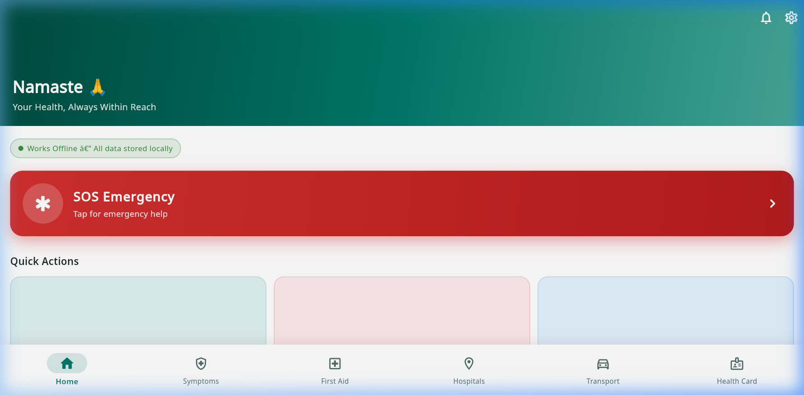
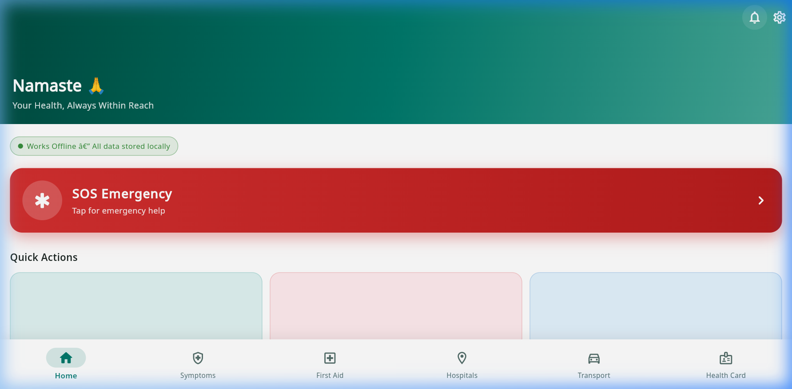
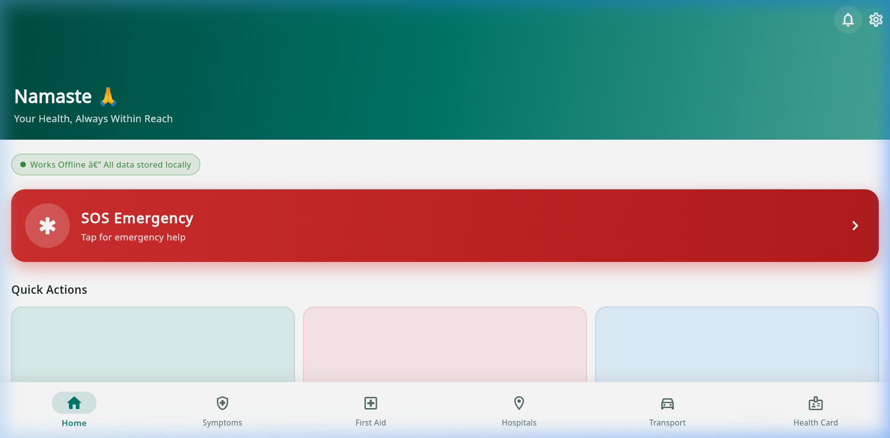

# 🏥 AarogyaSathi — Offline AI Health Assistant for Rural India

> An **offline-first** AI health assistant for rural India — works without internet, supports English, Hindi & Marathi, built for Palghar District, Maharashtra.

[](LICENSE)
[](https://flutter.dev)
[]()
[]()

---

## 🎬 Demo Video


---

## 📸 Screenshots

| Home | Symptom Checker | Triage Result |
|------|----------------|---------------|
|  |  |  |

| First Aid Guide | First Aid Detail | Hospitals |
|----------------|-----------------|-----------|
|  |  |  |

| Emergency Transport | Ambulance Filter |
|--------------------|-----------------|
|  |  |

---

## 🚀 Quick Start — No Flutter Required!

### Only requirement: **Python** (pre-installed on macOS/Linux; [download for Windows](https://www.python.org/downloads/))

---

### ▶️ Windows — Double-click to run
```
1. Download / clone this repo
2. Double-click  start.bat
3. Open Chrome → http://localhost:3000
```

### ▶️ macOS / Linux
```bash
git clone https://github.com/bajrang07-source/OSD_AarogyaSathi.git
cd OSD_AarogyaSathi
chmod +x start.sh && ./start.sh
# Opens http://localhost:3000 automatically
```

### ▶️ Any OS (manual)
```bash
python -m http.server 3000 --directory build/web
# Then open: http://localhost:3000
```

> 💡 The `build/web` folder is included — **no compilation needed**. Just clone and run.

---

## ✨ Features

| # | Feature | Status |
|---|---------|--------|
| 1 | **Offline Hospital Finder** — 20 real Palghar District hospitals & PHCs | ✅ Done |
| 2 | **Offline First Aid Guide** — 8 emergency conditions with step-by-step instructions | ✅ Done |
| 3 | **Rule-Based Triage Engine** — Critical / High / Moderate / Low severity assessment | ✅ Done |
| 4 | **Voice Input + NLP** — Speak symptoms, auto-extracted with keyword NLP | ✅ Done |
| 5 | **Emergency Transport & Volunteers** — Ambulances, autos, ASHA workers with one-tap calling | ✅ Done |
| 6 | OCR Prescription Scanner | 🔜 Coming |
| 7 | Offline TTS (Text-to-Speech) | 🔜 Coming |
| 8 | Offline STT via Whisper.cpp | 🔜 Coming |

---

## 🏗️ Architecture

```
lib/
├── core/              # Theme, router, constants
│   ├── router/        # go_router navigation
│   └── theme/         # Material 3 design system
├── data/
│   ├── local_db/      # DatabaseSeeder — hospitals, first aid, transport
│   ├── models/        # Hospital, FirstAidTopic, TransportContact, TriageResult
│   └── repositories/  # Offline SQLite CRUD
├── features/
│   ├── home/          # Home screen + SOS + quick actions
│   ├── symptom_checker/ # Triage engine UI + voice input
│   ├── first_aid/     # Offline guide with search
│   ├── hospitals/     # PHC & hospital finder
│   ├── transport/     # Emergency contacts with filtering
│   └── health_card/   # Personal health profile (local)
└── services/
    ├── ai/            # TriageEngine + NLP keyword service
    ├── db/            # SQLite / WASM database service
    └── tts_stt/       # Voice input (speech_to_text)
```

**Tech Stack:**
- **Framework:** Flutter 3.44 + Dart 3.12
- **State Management:** Riverpod
- **Navigation:** go_router
- **Database:** sqflite (SQLite / WASM for web)
- **Voice:** speech_to_text
- **Fonts:** Google Fonts (Noto Sans — supports Devanagari)

---

## 🛠️ Developer Setup

### Requirements
- [Flutter SDK 3.44+](https://docs.flutter.dev/get-started/install)

```bash
# Clone
git clone https://github.com/bajrang07-source/OSD_AarogyaSathi.git
cd OSD_AarogyaSathi

# Install dependencies
flutter pub get

# Run in browser (web)
flutter run -d chrome

# Rebuild the web release bundle
flutter build web --release
python -m http.server 3000 --directory build/web

# Build Android APK (fully offline on phone)
flutter build apk --release
# APK → build/app/outputs/apk/release/app-release.apk
```

---

## 🌍 Language Support
- 🇬🇧 English
- 🇮🇳 Hindi
- 🇮🇳 Marathi

*(Full ARB localisation in Phase 12)*

---

## 📍 Target Region
Seeded for **Palghar District, Maharashtra** with real hospitals, PHCs, and local transport contacts. To adapt for another district, update [`lib/data/local_db/database_seeder.dart`](lib/data/local_db/database_seeder.dart).

---

## 📄 License

This project is licensed under the **MIT License** — free to use, modify, and distribute.

See [LICENSE](LICENSE) for full text.

---

## 🤝 Contributing
Pull requests are welcome! Open phases above show what's coming next.
